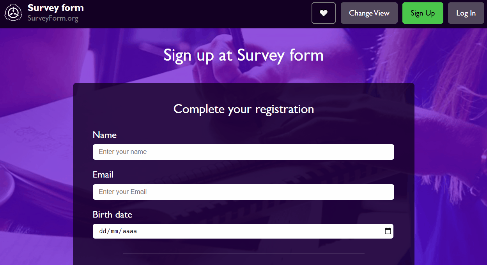

# Formulario
Formulário de cadastro com validação personalizada de campos e com consumo de API ViaCEP.
Para acessa-lo, <a href="https://raphael-ramalho.github.io/Formulario/">clique aqui</a>.
  

## 🛠️ Construído com
<ul>
 <li>Javascript
 <li>HTML5
 <li>CSS3
</ul>

## 📗 Principais conceitos colocados em prática:
<ul>
 <li>RegEX
 <li>input pattern
 <li>Tratamento de input value com .replace( )
 <li>Manipulação de datas
 <li>Manipulação do DOM
 <li>.forEach( )
 <li>.setCustomValidity( )
 <li>Requisição de API com async function
 <li>Captura de erro com try {} catch {}
</ul>
 

⌨️ com 💜 por Raphael Ramalho 😃
